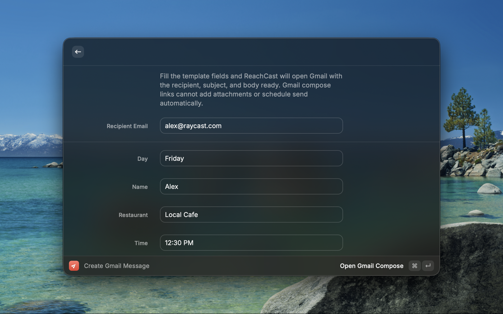

# ReachCast

[](https://raycast.com/)
[](https://www.typescriptlang.org/)
[](https://react.dev/)
[](./LICENSE)

> Fill a saved email template, press one key, and Gmail opens with the recipient,
> subject, and body already written. No more bouncing between a web page and your
> inbox to send the same message for the hundredth time.

## Why I built this

I built ReachCast while I was deep in a job search and sending a lot of cold
outreach. The flow was always the same and always annoying: read a job posting or
a person's page, switch to my Gmail tab, start a new message, switch back to copy
the name, the role, the link, switch again to paste it in, and repeat. Most of the
email never changed. Only a few details did.

So I turned the parts that change into `{{placeholders}}`. Now the email body lives
in a template I write once. When I want to reach out, I trigger ReachCast with a
single Raycast shortcut, fill in the few fields that are specific to that message,
and it opens Gmail with everything already in place. I attach my resume and hit
send. The constant back and forth is gone.

The name is `reach` plus Raycast, because it lives in the tool I already keep open
all day.

## What it does

| Command | What it does |
|---|---|
| **Create Gmail Message** | Reads your saved template, shows a field for every `{{placeholder}}` in it, and opens a prefilled Gmail compose window from your answers. |
| **Edit Email Template** | Edits the reusable subject and body. Any `{{name}}`-style token you add automatically becomes a field in the other command. |

The template is yours to shape. The version that ships is a simple "lunch plan"
example so the idea is obvious, but you can rewrite it into a cold-outreach note,
a follow-up, an intro request, or anything else you send often.

## How it works

The whole extension is built around one idea: **placeholders drive the form.**

1. You write a template with tokens, for example:

   ```text
   Subject: Quick note for {{company}}

   Hi {{name}},

   I came across the {{role}} role and wanted to reach out...
   ```

2. ReachCast scans the subject and body, finds every `{{token}}`, and renders one
   input field per token. Longer fields like `{{note}}` or `{{message}}` render as
   multi-line text areas automatically.

3. When you submit, it swaps your answers into the template and builds a Gmail
   compose URL, so Gmail opens with the recipient, subject, and body ready to send.

Your template is saved locally with Raycast's `LocalStorage`, so it persists
between launches. There is no account, no server, and nothing leaves your machine
except the Gmail compose link you choose to open.

### A note on Gmail limits

Gmail compose links cannot attach files or schedule send on their own. ReachCast
gets the message ready and, if you want, reminds you to attach documents or pick a
send time in Gmail before you send. Those last two steps stay in your hands on
purpose.

## Screenshots

### Create Gmail Message

Fill the fields generated from your template:



### Edit Email Template

Edit the reusable subject and body, with custom placeholders:


## Running it locally

Requires [Raycast](https://raycast.com/) and Node 18+.

```bash
npm install
npm run dev      # loads the extension into Raycast in development mode
```

Then open Raycast and search for **Create Gmail Message** or **Edit Email
Template**. Other useful scripts:

```bash
npm run build    # production build
npm run lint     # lint and validate the extension
```

## Tech stack

| Layer | Choice |
|---|---|
| Platform | Raycast extension API |
| Language | TypeScript, React |
| Storage | Raycast `LocalStorage` (template persistence) |
| Tooling | ESLint, Prettier |

## Status

Submitted to the Raycast Store
([raycast/extensions#27590](https://github.com/raycast/extensions/pull/27590)).
Works for any reusable email, not just job outreach.
